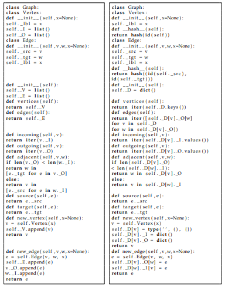
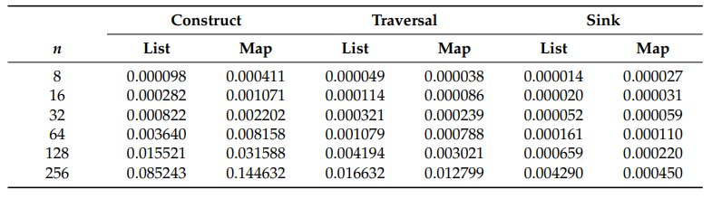

<!-- headings -->
<center>`<h1>Resumen de la Actividad 2</h1>`</center>

<!-- IMAGES -->
<!--  -->

<!--  -->

<!-- GITHUB MD -->
<h3> 1. Introduction</h3>
```
Adjacency lists have been the preferred graph representation for over five decades now
because a large number of graph algorithms can be implemented to run in linear time in
the number of vertices and edges in the graph using an adjacency-list representation, while
no graph algorithm can be implemented to run in linear time using an adjacency-matrix
representation.
```
<br />
<br />

```
The only exception to the latter is the sparse representation of static directed
graphs of [1], which uses (allocated, but uninitialized) quadratic space in the number of
vertices in the graph and allows for implementing graph algorithms that test edge existence,
such as finding a universal sink (a vertex of in-degree equal to the number of vertices minus
one and out-degree zero) in a directed graph ([2] [Ex. 22.1-6]), to run in linear time in the
number of vertices and edges in the graph.
```
<br />
<br />

```
Graph algorithms can be described using a small collection of abstract operations on
graphs, which can be implemented using appropriate data structures such as adjacency
matrices, adjacency lists, and adjacency maps.

A smaller collection of 32 abstract operations is described in [5], which allows for
describing most graph algorithms. Actually, the following collection of only 11 abstract
operations suffices for describing most of the fundamental graph algorithms, where lists of
vertices and edges are arranged in the order fixed by the representation of the graph. Much
of the following is adapted from ([5] [Section 1.3]).
```
<center><h2>Algorithm 1 Simple traversal of an undirected graph G</h2></center>

```
for all v ∈ G.vertices() do
for all e ∈ G.outgoing(v) do
w = G.target(e)
. . .

```
<br />
<br />

```
Essentially, the adjacency list representation of a graph is an array of lists, one for
each vertex in the graph, where the list corresponding to a given vertex contains the target
vertices of the edges coming out of the given vertex. However, this is often extended by
making edges explicit, as follows:
```
<br />
<br />

```
-Definition 1.
```
<br />
<br />

``` 
Let G = (V, E) be a graph with n vertices and m edges. The adjacency list
representation of G consists of a list of n elements (the vertices of the graph), a list of m elements
(the edges of the graph), and two lists of n lists of a total of m elements (the edges of the graph). The
incoming list corresponding to vertex v contains all edges (u, v) ∈ E coming into vertex v, for all
vertices v ∈ V. The outgoing list corresponding to vertex v contains all edges (v, w) ∈ E going out
of vertex v, for all vertices v ∈ V. The source vertex v and the target vertex w are associated with
each edge (v, w) ∈ E.
```
<br />
<br />

```
The adjacency list representation of a graph G = (V, E) with n vertices and m edges
takes O(n + m) space, and it allows for implementing graph algorithms such as depth-first
search, biconnectivity, acyclicity, planarity testing, topological sorting, and many others to
take O(n + m) time [6,7].
In the adjacency list representation of a graph, edges can also be made explicit by
replacing the lists of incoming and outgoing edges with dictionaries of source vertices to
incoming edges and target vertices to outgoing edges
```
<br />
<br />

```
-Definition 2. 
```
<br />
<br />

```
Let G = (V, E) be a graph with n vertices and m edges. The adjacency map
representation of G consists of a dictionary of n elements (the vertices of the graph) to a pair of
dictionaries of m elements (the source and target vertices for the edges of the graph, respectively).
The incoming dictionary corresponding to vertex v contains the mappings (u,(u, v)) for all edges
(u, v) ∈ E coming into vertex v, for all vertices v ∈ V. The outgoing dictionary corresponding to
vertex v contains the mappings (v,(v, w)) for all edges (v, w) ∈ E going out of vertex v, for all
vertices v ∈ V.
```
<br />
<br />
<br />

<h3> 2. Materials and Methods</h3>
We have implemented 9 of the 11 abstract operations on graphs in Python, namely
<br />
<br />
G.vertices()
<br />
G.edges()
<br />
G.incoming(v)
<br />
G.outgoing(v)
<br />
G.adjacent(v, w)
<br />
G.source(e)
<br />
G.target(e)
<br />
G.new_vertex()
<br />
G.new_edge(v, w)
<br />
<br />
for both the adjacency list and the adjacency map representation, and for labeled vertices
and edges. Figure 2 shows the corresponding classes in detail.
For the benchmark dataset, we have used random directed graphs with n = 8, 16, 32, 64,
128, 256 vertices and m = 1, . . . , n(n − 1) directed edges. These 86,856 directed graphs were
generated using the Erd˝os–Rényi model, by which all (directed) graphs with n vertices
and m (directed) edges have the same probability [10,11], as implemented in the NetworkX
package for network analysis in Python [9].
<br />
<br />

<br />
<br />

In order to compare the performance of the adjacency-list and the adjacency-map
representation, we have chosen three graph algorithms:
<br />
<br />
• A simple algorithm for constructing a graph from a list of edges, thereby testing the
performance of the abstract operations for adding new vertices and edges to a graph.
<br />
<br />
• An iterative algorithm for the breadth-first traversal of a graph ([5] [Section 5.2]),
thereby testing the performance of the abstract operations for iterating over the vertices
and edges of the graph.
<br />
<br />
• An algorithm for finding a universal sink of a directed graph ([2] [Ex. 22.1-6]), thereby
testing the performance of the adjacency-test abstract operation.
<br />
<br />
The universal sink algorithm, adapted from [1], is shown in Algorithm 2. The first
loop, which breaks at the first iteration, is used to set an initial candidate for the universal
sink to the first vertex in the order fixed by the representation of the graph (actually, any
vertex of the graph would suffice). <br />
The second loop is used to discard all but one of the
vertices in the graph as candidates for universal sink. The third loop is used to check if the
remaining candidate vertex indeed has in-degree equal to the number of vertices of the
graph minus one and out-degree zero.
<br />
<br />

<center><h2>Algorithm 2 Finding a universal sink in a directed graph G = (V, E) with |V| > 2</h2></center>
<br />
<br />
function universal_sink(G)
for all v ∈ vertices(G) do
break
<br />
for all w ∈ vertices(G) do
if v 6= w and G.adjacent(v, w) then
v = w
<br />
for all w ∈ vertices(G) do
if G.adjacent(v, w) or (v 6= w and not G.adjacent(w, v)) then
return false
return true
<br />
<br />
Assuming the adjacency test takes O(1) time, the graph construction algorithm, the
breadth-first graph traversal algorithm, and the universal sink algorithm all take O(n + m)
time, on a graph with n vertices and m directed edges.
<br />
<br />
<h3>3. Results</h3>

We have implemented the simple graph construction algorithm and the universal
sink algorithm in Python, taken the Python implementation of the breadth-first graph
traversal algorithm from ([5] [Appendix A]), and run the algorithms for graph construction,
breadth-first traversal, and universal sink on the 86,856 random directed graphs in the
benchmark dataset. Table 1 shows the average running time of each of the three algorithms
with the adjacency-list and the adjacency-map representation, over n(n − 1) = 56, 240,
992, 4032, 16,256, 65,280 random directed graphs with n = 8, 16, 32, 64, 128, 256 vertices,
respectively, on a computer with a 12-core Intel Xeon processor and 64 GB of memory.
<br />
<br />

<br />
<br />

The ratio of these average running times (adjacency maps over adjacency lists) for the
three graph algorithms are plotted in Figure 3. Graph construction is about 4 times slower
with adjacency maps for graphs with at most 16 vertices, but only about 2 times slower
for graphs with at least 128 vertices. On the other hand, breadth-first graph traversal and
the universal sink algorithm run faster with adjacency maps for all graph sizes in the case
of graph traversal and for graphs with at least 64 vertices in the case of universal sink on
the average.
<br />
<br />
Graph construction is almost always slower with adjacency
maps for graphs with 8, 16, or 32 vertices, but it is faster with adjacency maps for 170 of the
4032 graphs with 64 vertices, 2870 of the 16,256 graphs with 128 vertices, and 3599 of the
65,280 graphs with 256 vertices in the benchmark dataset.
<br />
Breadth-first graph traversal is almost always faster with adjacency maps: for all the
56 graphs with 8 vertices, 239 of the 240 graphs with 16 vertices, 989 of the 992 graphs
with 32 vertices, 4022 of the 4032 graphs with 64 vertices, 16,247 of the 16,256 graphs with
128 vertices, and 65,266 of the 65,280 graphs with 256 vertices in the benchmark dataset.
The universal sink algorithm is always slower with adjacency maps for graphs with 8 or
16 vertices, but it is faster with adjacency maps for 394 of the 992 graphs with 32 vertices,
2828 of the 4032 graphs with 64 vertices, 13,839 of the 16,256 graphs with 128 vertices, and
60,582 of the 65,280 of the graphs with 256 vertices in the benchmark dataset.